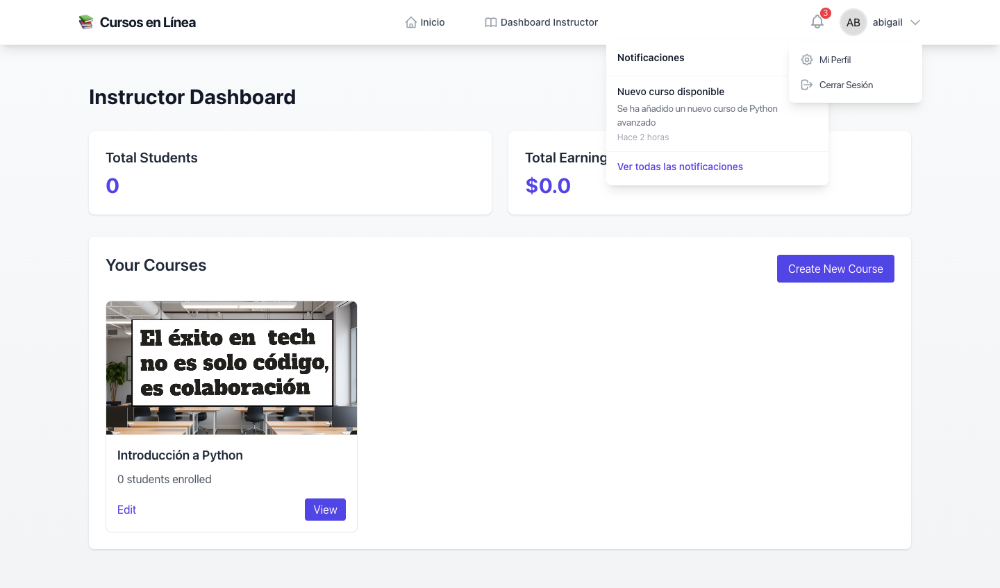

# Plataforma de Cursos en Línea

Este proyecto es una plataforma de cursos en línea desarrollada con **Ruby on Rails 8**. Permite la gestión de usuarios (estudiantes e instructores), la creación de cursos con secciones y lecciones, y un sistema de inscripciones y pagos.

## 🚀 Características Principales

- **Autenticación de Usuarios** con Devise.
- **Roles de Usuario** (Estudiante, Instructor, Administrador).
- **Gestión de Cursos** con secciones y lecciones.
- **Sistema de Inscripciones** a cursos.
- **Pagos** con Stripe y PayPal para la compra de cursos.
- **Diseño Responsivo** con Tailwind CSS.

## 🛠 Tecnologías Utilizadas

- **Backend:** Ruby on Rails 8
- **Base de Datos:** PostgreSQL
- **Frontend:** Tailwind CSS
- **Autenticación:** Devise
- **Pruebas:** RSpec, FactoryBot, Capybara
- **Pagos:** Stripe, PayPal

## img demo:
img inicio:

img cursos instructor:


## 📌 Instalación

### 1. Clonar el Repositorio

```sh
git clone https://github.com/tu-usuario/cursos-online.git
cd cursos-online
```

### 2. Instalar Dependencias

```sh
bundle install
```

### 3. Configurar la Base de Datos

```sh
rails db:create
rails db:migrate
```

### 4. Ejecutar el Servidor

```sh
rails server
```

Abre [http://localhost:3000](http://localhost:3000) en tu navegador.

## 🔑 Creación de un Usuario Admin

Para crear un usuario administrador, abre la consola de Rails y ejecuta:

```sh
rails console
```

```ruby
User.create!(email: "admin@example.com", password: "password123", role: :admin)
```

## 📌 Rutas Principales

### **Rutas de Autenticación (Devise)**
- `GET /users/sign_in` - Página de inicio de sesión
- `POST /users/sign_in` - Iniciar sesión
- `DELETE /users/sign_out` - Cerrar sesión
- `GET /users/sign_up` - Registro de usuario
- `POST /users` - Crear usuario

### **Rutas de Cursos**
- `GET /courses` - Listar cursos
- `GET /courses/:id` - Ver un curso específico
- `GET /courses/new` - Formulario para crear un curso (solo instructores)
- `POST /courses` - Crear un curso (solo instructores)
- `GET /courses/:id/edit` - Formulario para editar un curso (solo instructores)
- `PATCH /courses/:id` - Actualizar un curso (solo instructores)
- `DELETE /courses/:id` - Eliminar un curso (solo instructores)

### **Rutas de Inscripciones**
- `POST /courses/:id/enrollments` - Inscribirse en un curso (solo estudiantes)
- `GET /users/:id/courses` - Ver los cursos en los que está inscrito un estudiante

### **Rutas de Pagos**
- `POST /payments/checkout` - Iniciar proceso de pago
- `GET /payments/success` - Confirmación de pago exitoso
- `GET /payments/cancel` - Cancelación de pago

## ✅ Pruebas

Ejecuta las pruebas con:

```sh
rails test
```

## 📝 Tareas Pendientes

### Integración de Pagos
- Completar la integración con Stripe (webhooks y manejo de eventos)
- Finalizar la integración con PayPal (webhooks y manejo de eventos)
- Mejorar el proceso de aprobación de transferencias bancarias
- Implementar sistema de reembolsos
- Añadir reportes financieros para administradores

### Gestión de Usuarios
- Mejorar el sistema de usuarios pausados
- Implementar sistema de notificaciones en tiempo real
- Añadir opciones de recuperación de cuenta
- Implementar verificación en dos pasos

### Cursos y Contenido
- Añadir soporte para contenido multimedia (videos, archivos)
- Implementar sistema de progreso del estudiante
- Añadir foros de discusión por curso
- Implementar sistema de calificaciones y evaluaciones

### Certificados
- Mejorar el diseño de los certificados
- Añadir sistema de verificación de certificados
- Implementar compartir certificados en redes sociales

### Interfaz de Usuario
- Optimizar para dispositivos móviles
- Mejorar la accesibilidad
- Implementar modo oscuro
- Añadir más opciones de personalización

### Infraestructura
- Configurar CDN para archivos estáticos
- Implementar caché para mejorar rendimiento
- Configurar monitoreo y alertas
- Mejorar la seguridad general del sistema

## 📄 Licencia

Este proyecto está bajo la Licencia MIT - ver el archivo LICENSE para más detalles.


